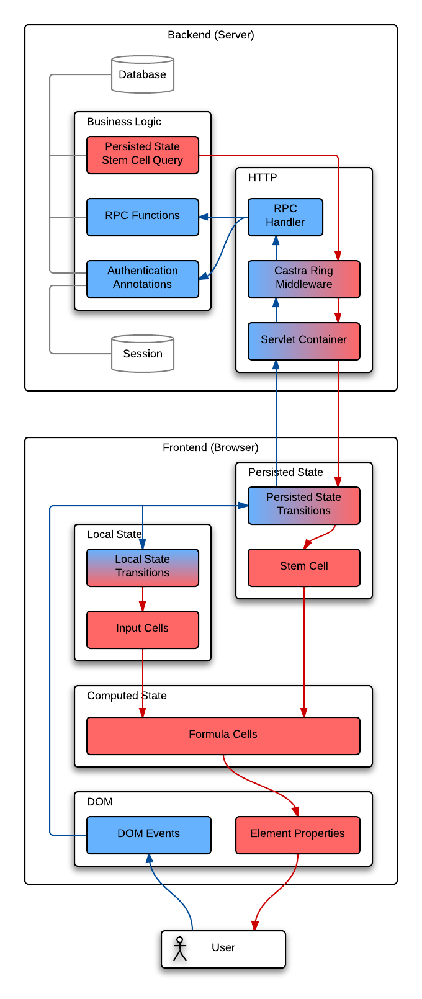

[](https://waffle.io/tailrecursion/castra)
![masada][2]

# Castra

Web application RPC library for Clojure/Script and Ring.

[](dependency)
```clojure
[hoplon/castra "3.0.0-alpha7"] ;; latest release
```
[](/dependency)

## The Big Picture

The purpose of Castra is to make async server calls feel like
expression evaluation, providing a more cohesive programming
experience across the front end and back end of your system. Instead
of thinking "I'm going to send this data bag in a POST to the `/xyz`
endpoint," supports you in thinking thoughts like "I'm going to
evaluate the expression `(update-record 123 {:x 1 :y 2})` on the
server."

Castra's front-end and back-end libraries implement this RPC pattern.

RPC does come with baggage, though. Implementing an RPC framework that
provides a seamless and transparent remote execution model is a very
difficult distributed systems problem. Castra does not attempt this.
Instead, Castra's RPC model embraces the asynchronous nature of client
server communication.

> Applicable buzzwords, if you're not into the whole brevity thing, are
> **_unidirectional dataflow_** and the **_CQRS_** pattern.

## Overview

Castra spans the gap between server and client. This makes documentation
a bit more difficult. This section will jump back and forth between client
and server code &mdash; it should be understood that the server code is
Clojure and client is ClojureScript.

### Server

Most of the magic happens in Castra's `castra.middleware/wrap-castra`
ring middleware. This middleware looks for an expression under the
`:body` key of the ring request map. It looks for a request that looks
something like:

```clojure
{:request-method :post
 :body "(my.app/update-record 123 {:x 1 :y 2})"}
```

* The Castra middleware deserializes the body to obtain Clojure forms.
* It then dispatches the expression `(my.app/update-record 123 {:x 1 :y 2})`
  by resolving and attempting to call the function `my.app/update-record`.
  (This function should be created with `castra.core/defrpc`, explained below.)
* The Castra middleware then returns a ring response map with the serialized
  result in the `:body` and a 200 status.

You can think of the response as if it were this:

```clojure
{:status 200
 :body (pr-str (my.app/update-record 123 {:x 1 :y 2}))}
```

Obviously, we don't want the client to be able to evaluate arbitrary
expressions on the server (we already have [nREPL][nrepl] for that). We
want to be able to mark certain functions as part of our application's
RPC interface. This is accomplished with `castra.core/defrpc`:

```clojure
(ns my.app
  (:require
    [castra.core :as c]
    [some.database :as db]))

(c/defrpc get-record
  [id]
  (first (db/query "SELECT * FROM record WHERE id = ?" id)))

(c/defrpc update-record
  [id {:keys [x y]}]
  (db/execute "UPDATE IN record SET x = ?, y = ? WHERE id = ?" x y id)
  (get-record id))
```

### Client

Castra provides a ClojureScript library for creating the RPC stub functions
the client will call. These are constructed by the `castra.core/mkremote`
function.

```clojure
(ns my.app.client
  (:require
    [castra.core :as c]
    [javelin.core :as j :include-macros true]))

(j/defc record  nil)
(j/defc error   nil)
(j/defc loading nil)

(def get-record    (c/mkremote 'my.app/get-record    record error loading))
(def update-record (c/mkremote 'my.app/update-record record error loading))
```

The `mkremote` function takes four arguments, three of which are
[Javelin][javelin] cells:

1. The **fully qualified symbol** associated with the `defrpc` on the server.
2. The **state cell**, where the result will go if the operation succeeded.
3. The **error cell**, where the exception will go if the operation failed.
4. The **loading cell**, which will contain a vector of all in-flight RPC requests.

This defines the `get-record` and `update-record` functions in the client,
which can be called like any other ClojureScript function.

#### Hoplon Example:

Using the server and client code above, we can make a little webapp that
shows us the contents of a record.

* The user interface will display the current record at the top of the page.
* The user may enter an id into a text input to view a different record.
* The interface displays an indication when remote operations are in progress.
* The interface displays error messages when remote operations fail.

Here is a simple [Hoplon][hoplon] page that satisfies these requirements:

```clojure
(page "index.html"
  (:require
    [my.app.client :as c]))

(defc= loading?      (some-> c/loading seq count))      ; contains count of in-flight commands
(defc= error-message (some-> c/error .-message))        ; contains the last command's error message

(c/get-record 1)                                        ; get record 1 when page first loads

(html
  (head)
  (body
    (p :toggle loading?                                 ; show when things are being processed
      (text "Processing ~{loading?} requests..."))

    (p :toggle error-message                            ; show when an operation fails
      (text "Error: ~{error-message}"))

    (p (text "Record: ~{c/record}"))                    ; display the current record

    (let [id (cell nil)]
      (form :submit #(c/get-record @id)                 ; edit and submit form to load record
        (p (label "Record ID: ")
            (input :value id :keyup #(reset! id @%)))
        (p (button :type "submit" "submit"))))))
```

There are a few things to notice about this application:

* Commands to change state **do not return a value** &mdash; the value is
  updated in a Javelin cell asynchronously when the command completes
  successfully.
* Dataflow is **unidirectional** (i.e. getting and changing state are via
  separate constructs) &mdash; getting via formula cells, and setting via
  RPC functions.
* The place that commands the change (eg. the `form` above) **does not need
  to know or care** which places will respond to the change (eg. the `p`
  displaying the current record), and vice versa.

### Dataflow



The diagram to the right illustrates the flow of data through the application.
There are actually two dataflow loops in the program:

* A **local loop** for editing the record id form value, and
* a **remote loop** which sends commands to the server.

#### Local Loop

1. The user types in the input element.
2. The `keyup` DOM event fires, triggering a **state transition** (callback).
3. The callback calls `reset!` on the `id` cell, updating its value.
4. The `value` property of the input element is bound to the `id` cell,
   so it is automatically updated when `id` changes.
5. The user sees the new value in the input element.

#### Remote Loop

1. The user submits the form.
2. The `submit` DOM event fires, triggering the callback.
3. The callback performs an RPC command, `get-record`.
4. When the RPC command completes the `c/record` cell is automatically updated
   with the new current record.
5. The `textContent` property of the text node displaying the current record
   is bound to a formula cell that updates when `c/record` changes.
6. The user sees the new record's value in the page.

Notice how similar the two cases are. The main difference is at step 3. In
the local loop the callback directly updates the `id` cell with the
synchronously with `reset!`. In the remote loop the `c/record` cell is
updated asynchronously with Castra.

## Examples

The [Hoplon Demos][1] repo contains demo apps using Castra.

## TODO

* explain `defrpc` and endpoints.
* explain validation

## License

Copyright © 2013 FIXME

Distributed under the Eclipse Public License, the same as Clojure.

[1]: https://github.com/hoplon/demos
[2]: https://raw.github.com/hoplon/castra/master/img/Masada.png
[nrepl]: https://github.com/clojure/tools.nrepl
[hoplon]: https://github.com/hoplon/hoplon
[javelin]: https://github.com/hoplon/javelin
